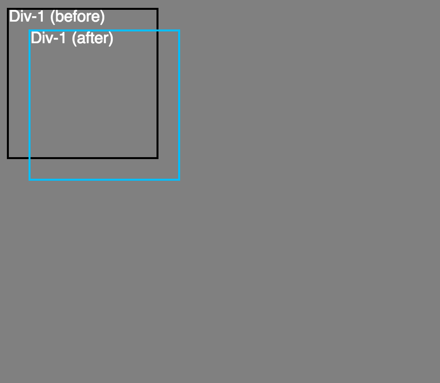
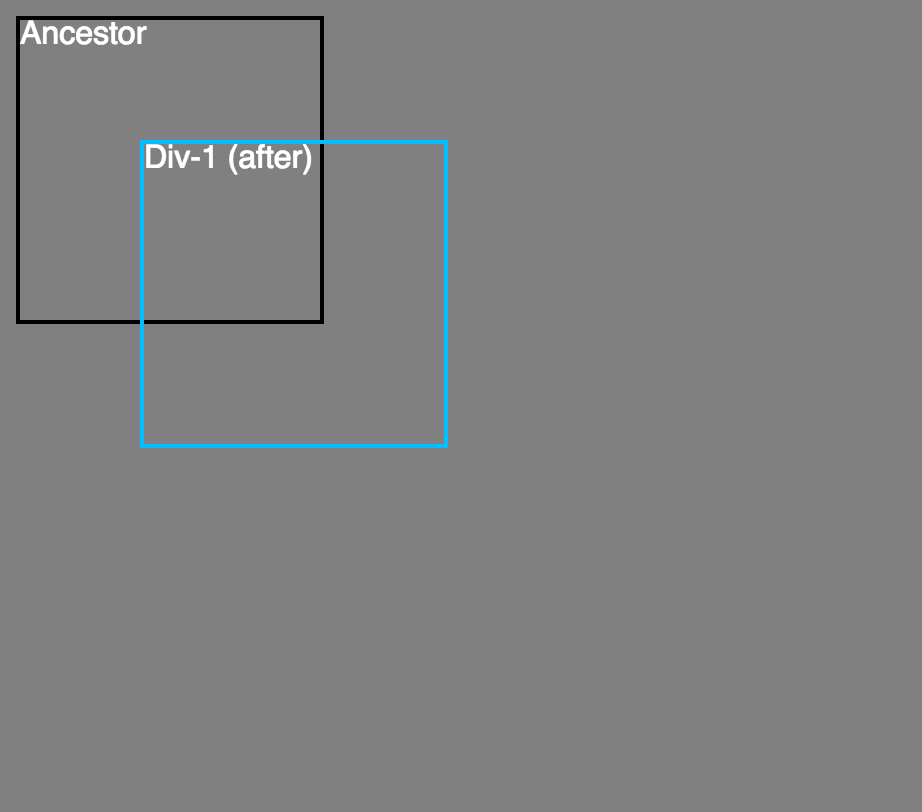
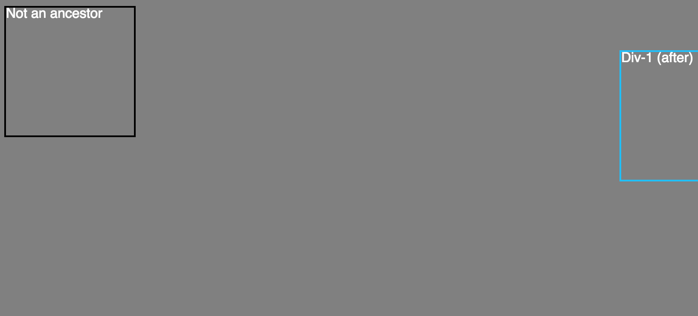
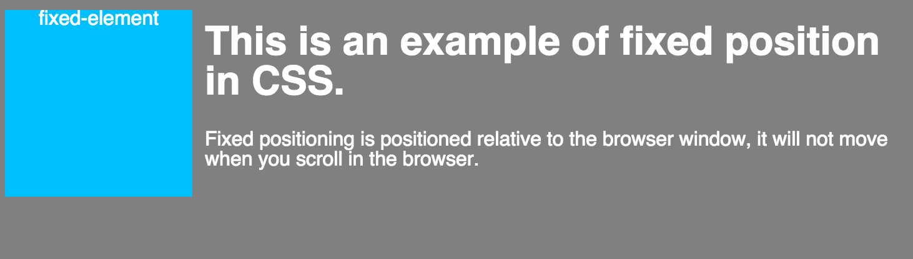
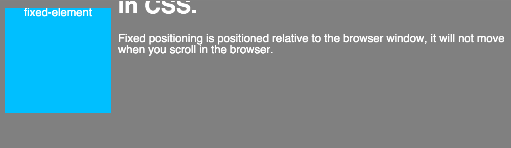

## Relative positioning
<p>

</p>

```css
 #Div-1 {
 position: relative;
 top: 20px;
 left: 20px;
 width: 150px;
 height: 150px;
 border: 2px solid deepskyblue;
 }
```

If you use <code>position: relative;</code> you need to specify its <code>top:</code>, <code>bottom:</code>, <code>left:</code> or <code>right:</code> in this example, the top and bottom are specified to move 20px from the top and 20px from the left. You can see where Div-1 was located after the css position is applied.

## Absolute positioning
<p>

</p>

When using <code>position: absolute;</code>, it's important to keep in mind that it depends on its "nearest position ancestor". Notice that Div-1 is positioned -60px to the right.

```css
#Ancestor {
  position: relative;
  width: 150px;
  height: 150px;
  border: 2px solid black;
}
```
```css
#Div-1 {
  position: absolute;
  top: 60px;
  right: -60px;
  width: 150px;
  height: 150px;
  border: 2px solid deepskyblue;
}
```

If there is no ancestor, Div-1 positions itself relative to the browser window, -60px to the right.


</p>

```css
#Div-1 {
  position: absolute;
  top: 60px;
  right: -60px;
  width: 150px;
  height: 150px;
  border: 2px solid deepskyblue;
}
```

## Fixed positioning
Fixed positioning is positioned relative to the browser window, it will not move when you scroll in the browser.
<p>


</p>

```css
#fixed-element {
  position: fixed;
  width: 150px;
  height: 150px;
  background-color: deepskyblue;
}
```