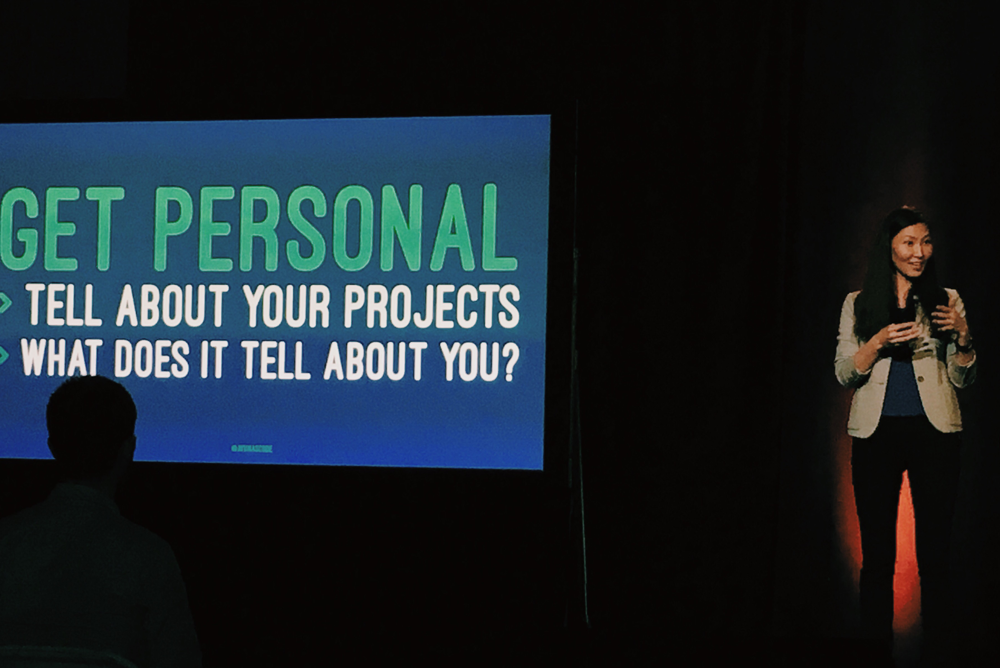

San Francisco is where you want to be especially when you want to be surrounded by innovation, learning resources and support as a developer. Through <a href="https://www.womenwhocode.com/">Women Who Code</a>, I received a ticket to attend <a href="https://www.twilio.com/signal">Twilio Signal Conference</a>!

<a href="https://www.twilio.com/">Twilio</a> is a communications platform, it provides SMS and IP messaging among the many services they offer. They provide ways to make communicating easier, allowing businesses to get in touch with their users better and faster. On the second day of the conference, Twilio announced <a href="https://www.twilio.com/notify">Notify</a>, a service that helps reach customers better by reaching them how they want to be reached.

Twilio powers businesses and organizations to interact with their users, get leads for business and even save lives. I was really impressed how <a href="www.crisistextline.org">Crisis Text Line</a> uses Twilio to power their service.

<h5 style="margin-top: -20px;">
  Nancy Lubin CEO of Crisis Text Line
</h5>

### Sessions
I like to attend sessions that can teach a budding developer like me, ones that improve the way I market myself as a developer and also get to know tech products. I attended <a href="https://twitter.com/patio11">Patrick McKenzie's</a> talk about job hunting for engineers. He offered tips on how to write cold emails and other things related.

I learned about the H2 or HTTP 2 Server Push from <a href="https://twitter.com/dshafik">Davey Shafik's</a> HTTP/2 and Asynchronous APIs talk. He was really excited about Server Push which he called the 'holy grail' of H2 which allows the server to push resources to the client without the client asking for it.

I attended a bunch of great talks,<a href="https://twitter.com/quinnypig">Corey Quinn's</a> Terrible Ideas in Git, which I found amusing, a couple of IBM's talks about bots and Twilio Add-Ons and <a href="https://medium.com/@AyunasCode">Ayuna's</a> talk, Technical Blogging to Build Your Digital Presence. Get personal, she says, share what you've learned and tell about your projects and what does tells about you.

I had a great experience at Twilio Signal, not to mention the people I met. <a href="https://www.twilio.com/signal/$bash">$Bash</a> was super awesome as well, I enjoyed solving some <a href="twilio-bash.com">fun coding challenges </a> played shuffleboard and trading tickets for a prize.

To receive SMS updates on opportunities to help on non-profit tech projects, text "do good" to 894546.

