This post is long overdue, but I wanted share. I love hearing peoples stories so when I heard about the Hustle 2X event on Twitter I wanted to go.

<!-- p tag to make lightense plugin work -->

  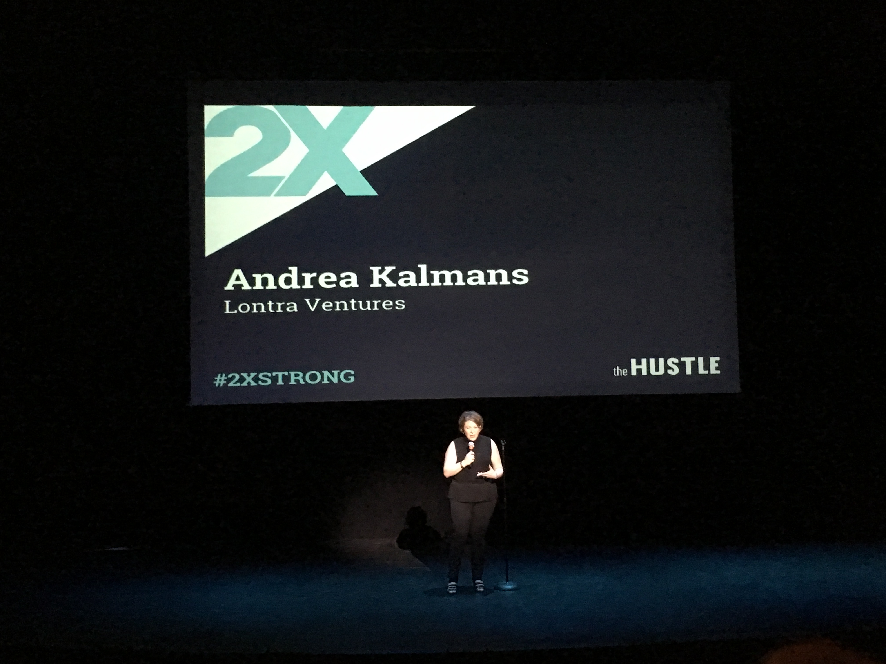
  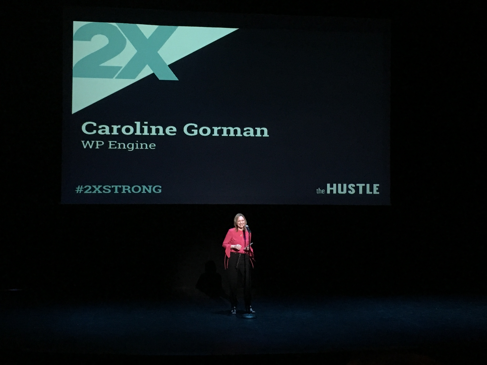
  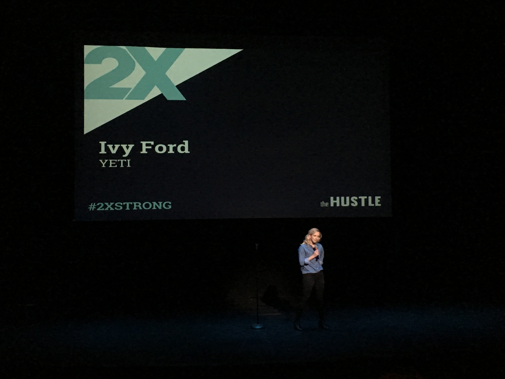
  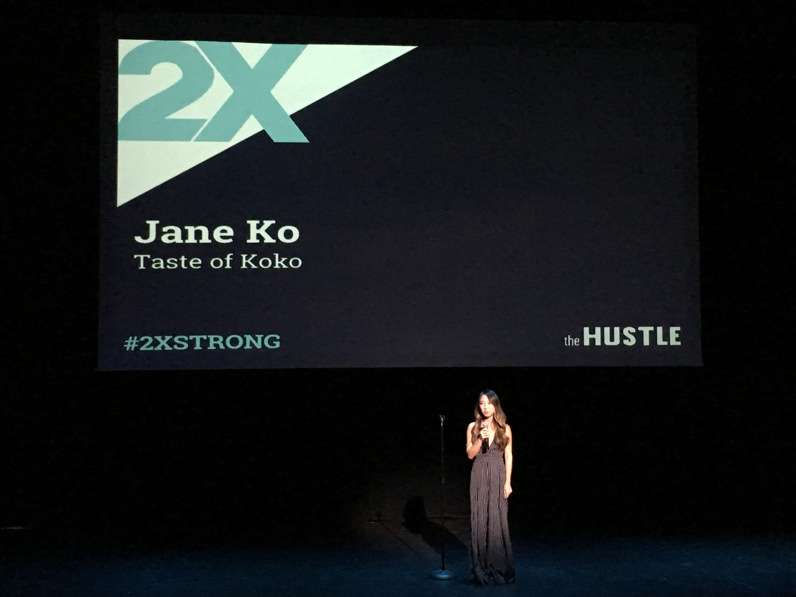
  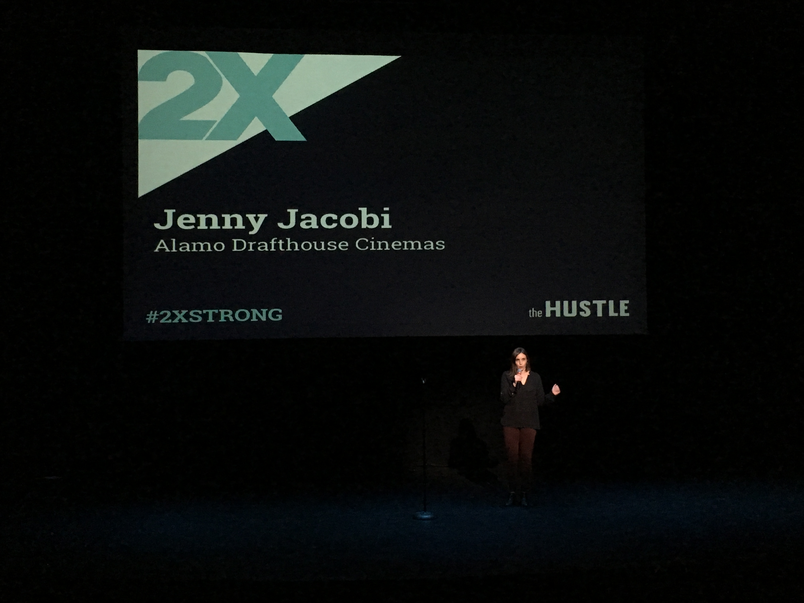
  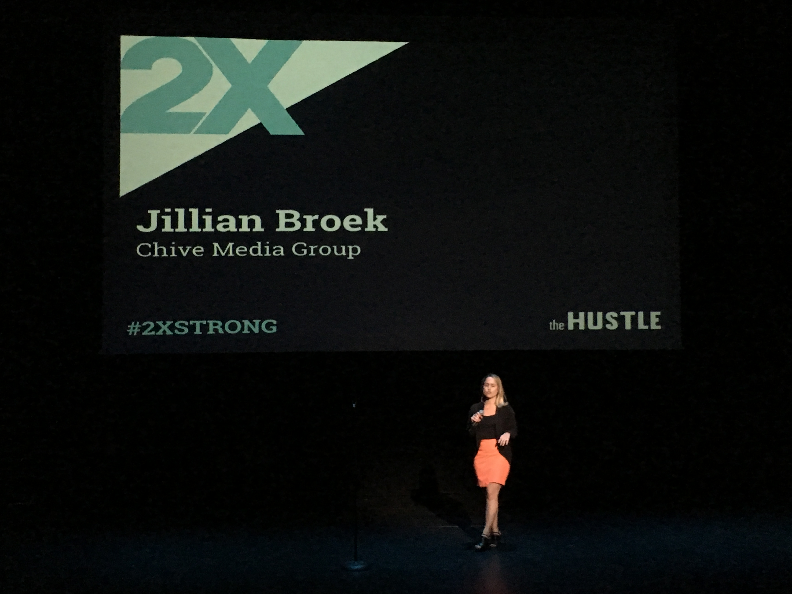
  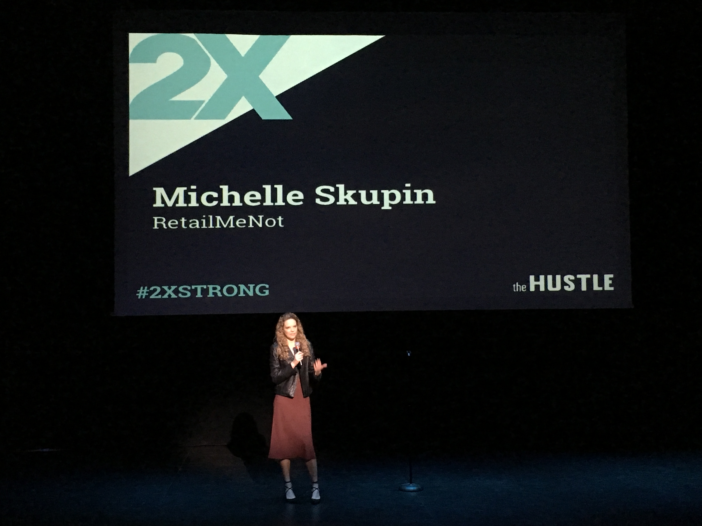
  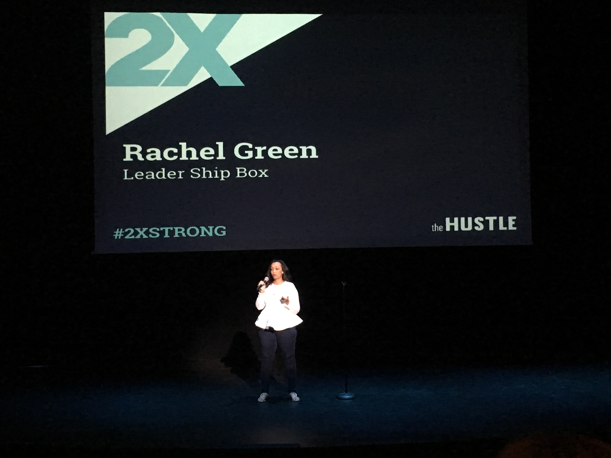
  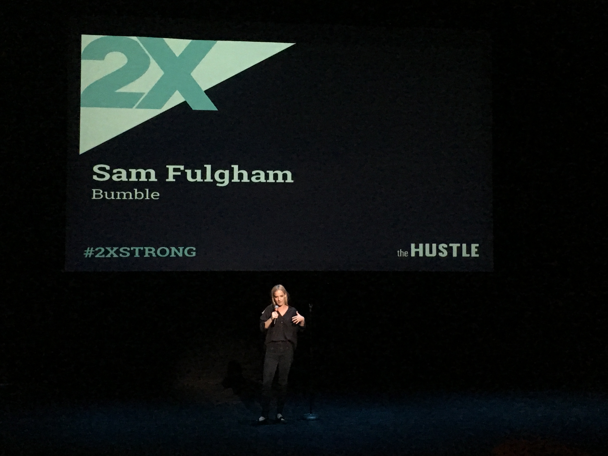
  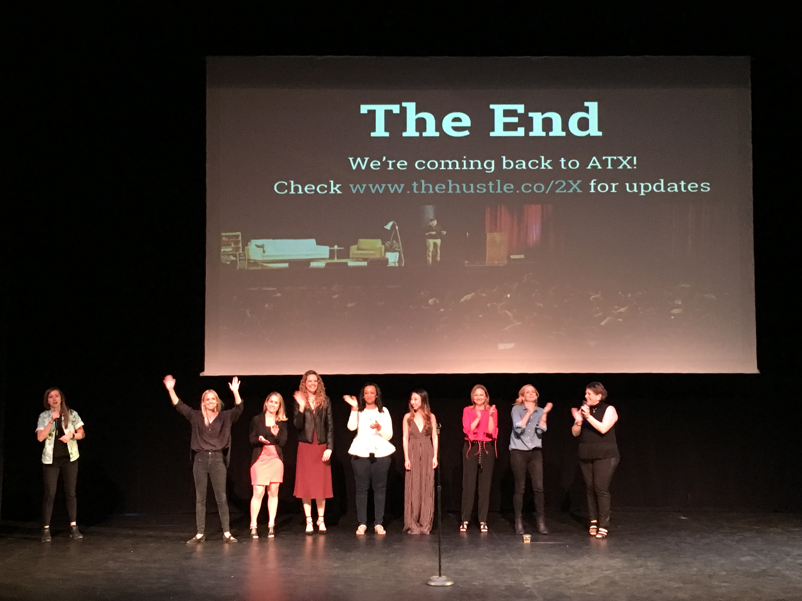
  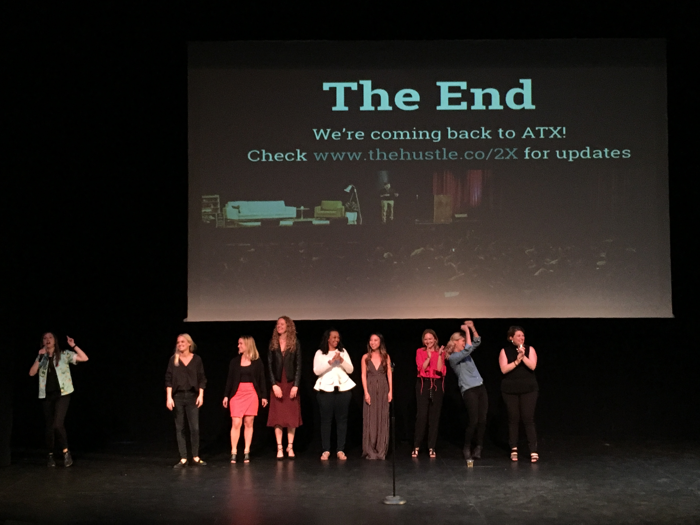

### Career path
Since the event happened a month ago, I mostly forgot the stories haha. One of the speakers said that spoke to me was that the career path isn't a linear one. You try to climb the ladder but things happen along the way that are not expected. What's good is that we meet people along the way that help us to get to where we want or need to go.

Most of the time, things don't usually end up going as planned but we just need to believe and push through and eventually get there.

&#9996;

  <a href="https://thehustle.co/2X/austin">Hustle 2X</a>

