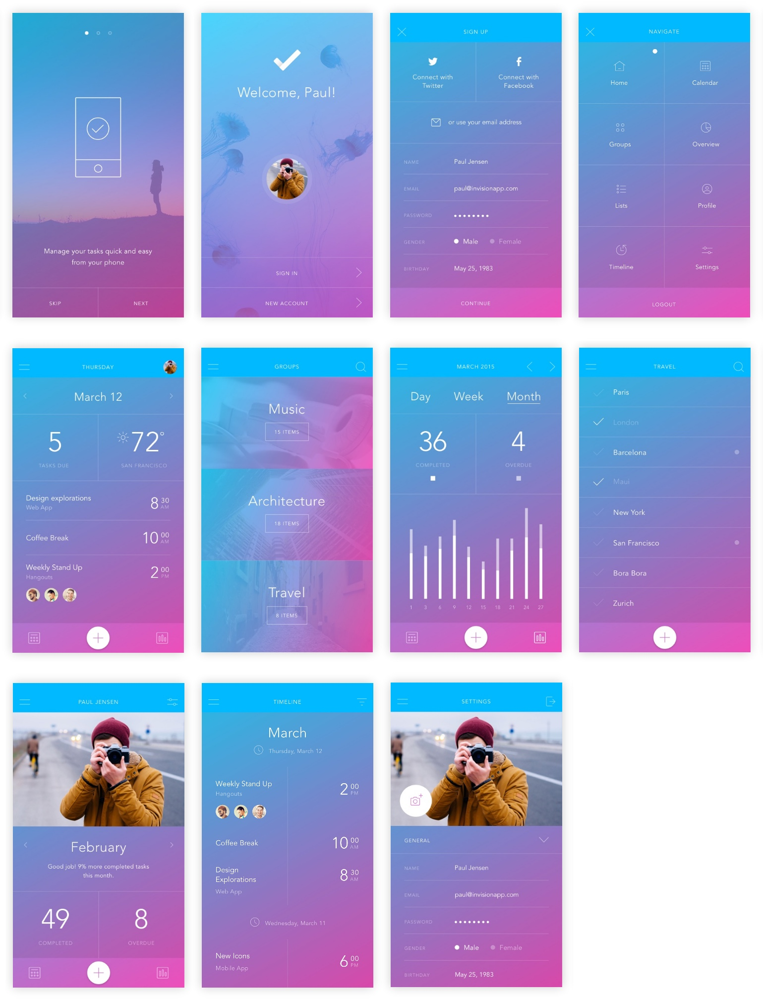

In this project, I wanted to improve my skills in CSS and Flexbox. I found awesome mockups from <a href="http://www.invisionapp.com/do">InVision</a> and used it to prototype a website, you can check it out <a href="https://prototype-task-app.firebaseapp.com">here</a>.

