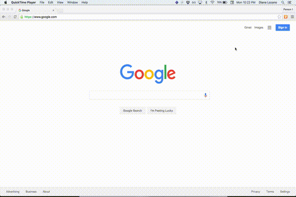
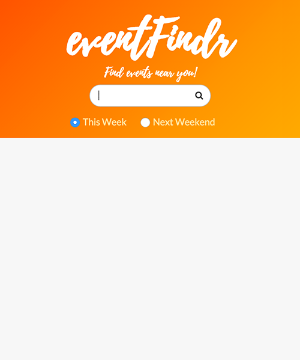
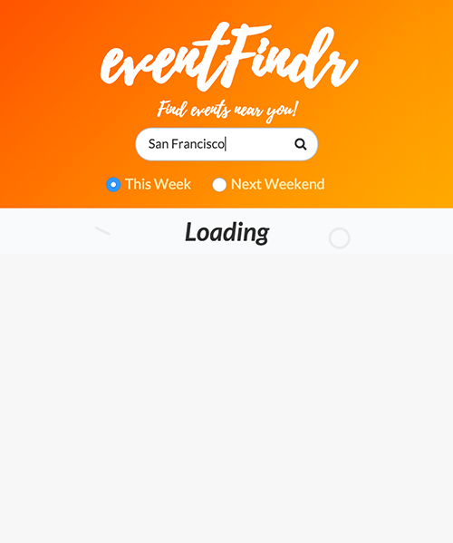
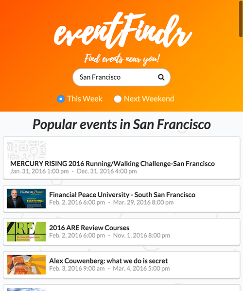

[eventFindr](https://github.com/cutofmyjib/eventFindr) is a Chrome extension that uses the Eventbrite API to help the user find events in a particular city they want. The user can choose to display events happening during the same week or the next weekend.

## **The look:**

I made a quick logo combining Eventbrite's and a map pin. I found some really cool fonts on Behance, I chose a hand-lettering font and made a quick layout and used Semantic UI for some components such as the event lists.

## **React:**
I'm still using React for most of my projects. I learned a lot how to implement it in a Chrome extension. I learned how to pass props properly, implementing radio buttons and a lot about how state works and knowing when to use react-router. I'm still scratching the surface but I'm getting better.

## **Extension:**
You can view or downloaded it on [github](https://github.com/cutofmyjib/eventFindr) or at the [chrome web store](https://chrome.google.com/webstore/detail/eventfindr/gcndpbmgdieminkckiigidajcjaepmgn).

