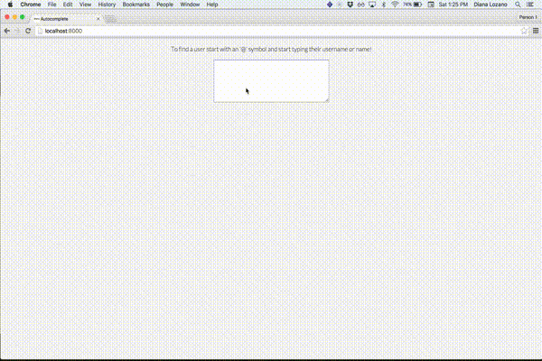

[Autocomplete](https://github.com/cutofmyjib/autocomplete) is a feature inside a comment box that assists a user to complete a user's name or username.

The approach I took is whenever a user types an '@' symbol, the autocomplete feature will pop up a list of users to indicate that the feature is listening. While the user starts to type, autocomplete begins to narrow down the search making it convenient to select from the list of results. The selected item is now appended to the comment box with the '@' symbol followed by the username.



For the most part of this project, I used JQuery. Before implementing the [textcomplete](https://github.com/yuku-t/jquery-textcomplete) library, I wanted to solve the challenge and the simple solution I came up with is the following:

Set up a listener in the textarea, if the
keypress is an '@' symbol...

```js
$("#commentbox").keypress(function(event){
  if (event.which === 64) {
```

Get the index of the '@' symbol to target the element following it. If the target character is not a space...

```js
$("#commentbox").on('keydown', function(event){
  var index = event.target.value.indexOf('@');
  var target = event.target.value.slice(index + 1);
  if (!(target === ' ')) {
```
Get the json through an ajax call

```js
$.ajax({
  url: "./data.json",
  dataType: "json",
  success: function(response){
    $("#users").empty();
    var matches = findUser(target, response);
    for (var i = 0; i < matches.length; i++) {
      $("#users").append("<p>" + matches[i].username + " - " + matches[i].name + "</p>")
    }
  }
})
```
In the findUser function I started with a for loop

```js
function findUser(input, data) {
  var re = new RegExp(input, 'i');
  var matches = [];
  for (var i = 0; i < data.length; i++) {
    if ((data[i].name.match(re)) || (data[i].username.match(re))) {
      matches.push(data[i]);
    }
  }
  return matches;
}
```
Which could be refactored to use the filter method:

```js
function findUser(input, data) {
  var re = new RegExp(input, 'i');
  return data.filter(function(user){
    return user.name.match(re) || user.username.match(re)
  })
}

```
I learned that even though this solution works, it isn't very good for production. I opted to use a library because it catches some of the instances that my simple solution doesn't cover such as when the input is '@@'.
