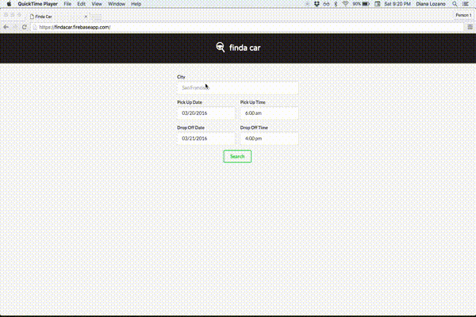
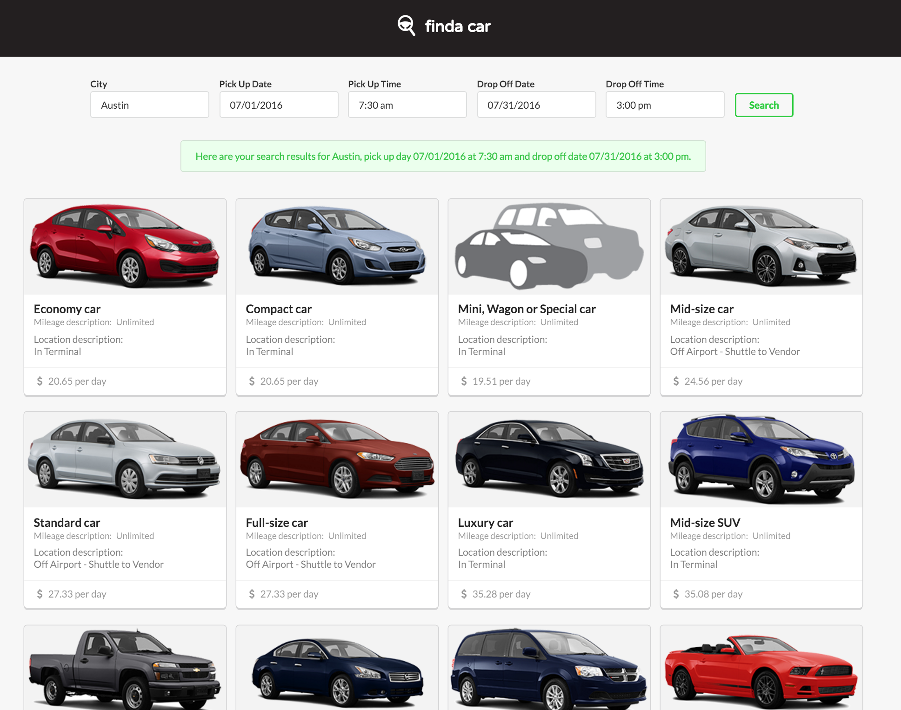

[finda car](https://github.com/cutofmyjib/find-a-car) is a web app that lets a user search a rental car by date, time and location. The app displays the available cars using data from Hotwire API.

## **React:**
I have been using React for most of my projects and I wanted to get more technical to know more about how routing works especially when consuming an API. During this project, I became more familiarized with AJAX, managing state and passing props using react-router's router push while transitioning to a different page. It also became easier to implement libraries or plugins such as the date and time picker that helped me build this app a lot faster.

My goal for this project was to write better code, get more familiarized with React and make it user-focused by letting them know of errors if any or a combination of the inputs were not valid. The Hotwire API was great for most of the error handling, I used it to create the components that were responsible for rendering the warning messages in the app.

## **The look:**

I wanted a simple logo to go with the app my goal was to come up with quick and minimal logo. I combined shapes that tells the user what the app does. For the web design part, I really like how Semantic UI makes it easier for me to nicely render most of the elements in this application, I went ahead and used it for this project so I can focus more on the technical side of things.

## **Check out the web app here:**
[finda car](https://findacar.firebaseapp.com)

