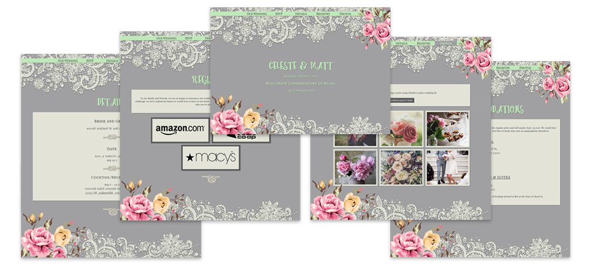
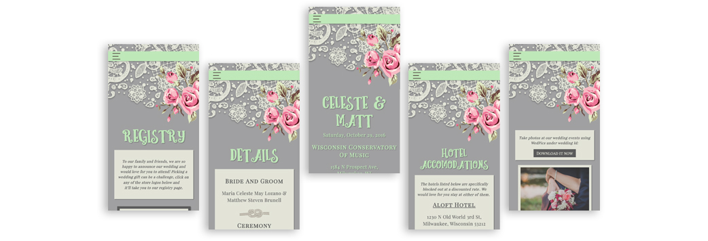

The wedding website is hand-coded in HTML, CSS and JavaScript using the React framework.

## **Design:**
I worked closely with the client and came up with various design mockups that have a rustic elegant feel using the chosen colors meadow and gray. The design elements used are free stock images as well as the fonts used.

## **Responsive**
I think making a site responsive especially for a wedding site is essential. The site navigation menu collapses into a menu icon, elements of the page resize and flow of layout change depending on the size of the screen the user has.

## **Check out the site here:**
[Wedding website](https://lozano-brunell.firebaseapp.com)

