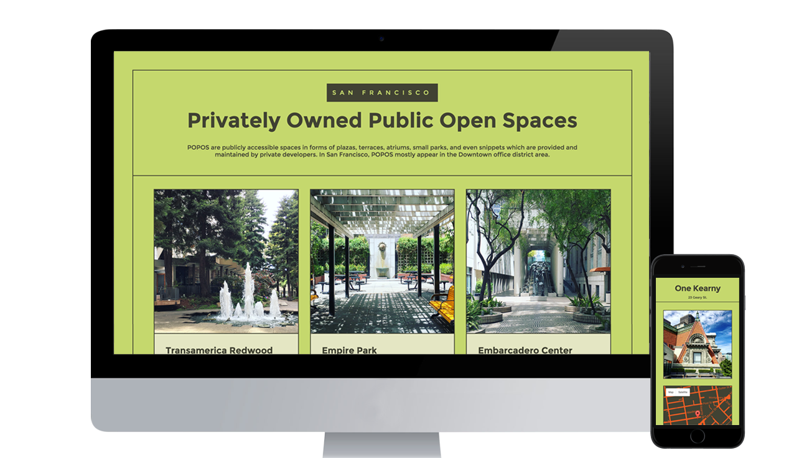

I first heard of public open spaces on a <a href="http://99percentinvisible.org/episode/episode-09-99-private/">99 Percent Invisible podcast</a>. I was searching for a public space San Francisco where I can study, bring my own food and not have to worry about spending. POPOS or Privately Owned Public Open Spaces are available for public use, anyone is welcomed to use the space, some are rooftop gardens, some are outdoor plazas, indoor "parks" or even atriums. In San Francisco, most of them are located in the downtown area or the <a href="http://default.sfplanning.org/zoning/zoning_map-042816.pdf">C-3 Districts</a>. This is mostly great, however, from what I've read, POPOS are not truly public spaces since it's a private property, the majority of its users are office workers, so the purpose that these spaces provide are limited to their users. Some POPOS have amenities that are great for working remotely, but they are not all created equally, they all vary. In this project, I wanted to expose public open spaces in San Francisco by providing the user a list of the good ones by showing the location, hours and images so they can be aware that they are available for public use.

## **Goals:**
I had many goals for this project, the primary goal is to let people know about POPOS, what they are, where, and what they look like. First, my goal was to provide better images since the images available online were either copyrighted, limited and/or poor quality. Part of the goal is learning and deploy the app before I move out of SF for a job opportunity in Austin this July.

## **Process**
Most of the work involved researching, finding data and taking photos. The information is mostly from <a href="http://sf-planning.org/privately-owned-public-open-space-and-public-art-popos">SF Planning Department</a> and <a href="http://www.spur.org/publications/spur-report/2009-01-01/secrets-san-francisco">SPUR</a>. I wanted to provide better images for the users, so a lot of the work involved me walking to each of the POPOS and taking and editing photos.

The design/layout didn't take too long, my priority was to focus on coding and deploying the app. The idea behind the layout is to show the list of POPOS and make it responsive when the size of the screen changes.

  

## **Stretch Goals**
After deploying the app, I think it can be improved greatly by adding a single map where all the POPOS pinned to it, the user might want to see which ones are closer to their location. Also adding background info about POPOS and amenities provided such as restrooms, accessibility, whether they are indoors or not and other things such as cafes nearby and wifi would be a great addition to the app.

## **Check out the app here:**
[SF POPOS](https://sfpopos.com)

  <a href="https://www.twitter.com/intent/tweet?text=@bossigner;url=https://sfpopos.com" target="_blank">Questions or comments?</a>

